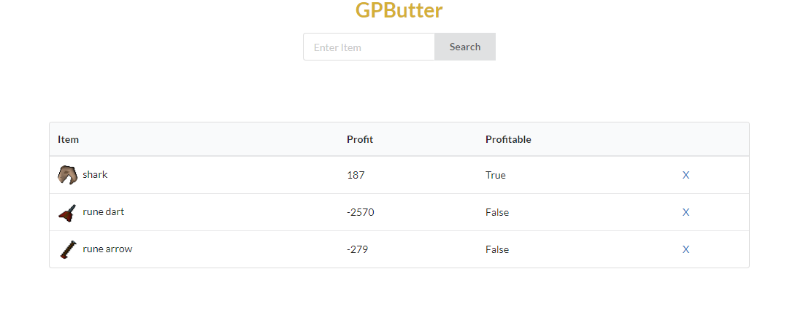

# GPButter
A simple tracker for Runescape go-to money making items (that require tradeable materials). 

# Usage
On https://gpbutter.herokuapp.com/, search items with tradeable materials. They will be listed with the profit margin and indicate whether it is profitable. 

# About
GPButter is a tool that's used to keep track of your favorite money making methods that have tradeable materials. GPButter scrapes the oldschool Runescape wiki to obtain the details for said item that the user inputs. The website was stylized with stylesheetUI.

This project runs on Flask for Python and uses CSS/Stylesheet for styling. 

